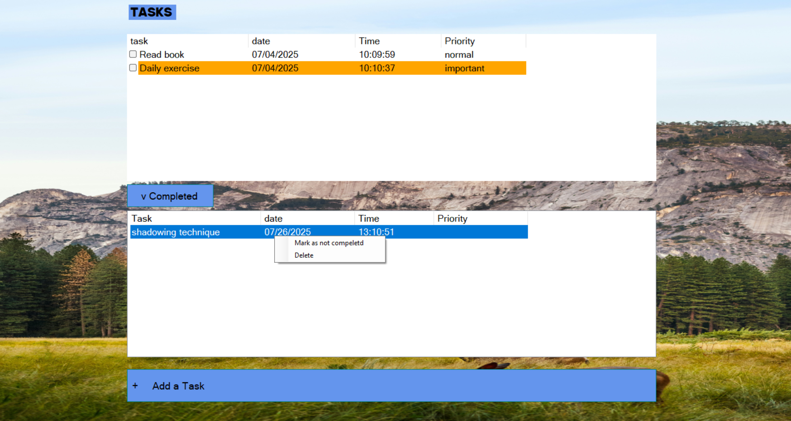
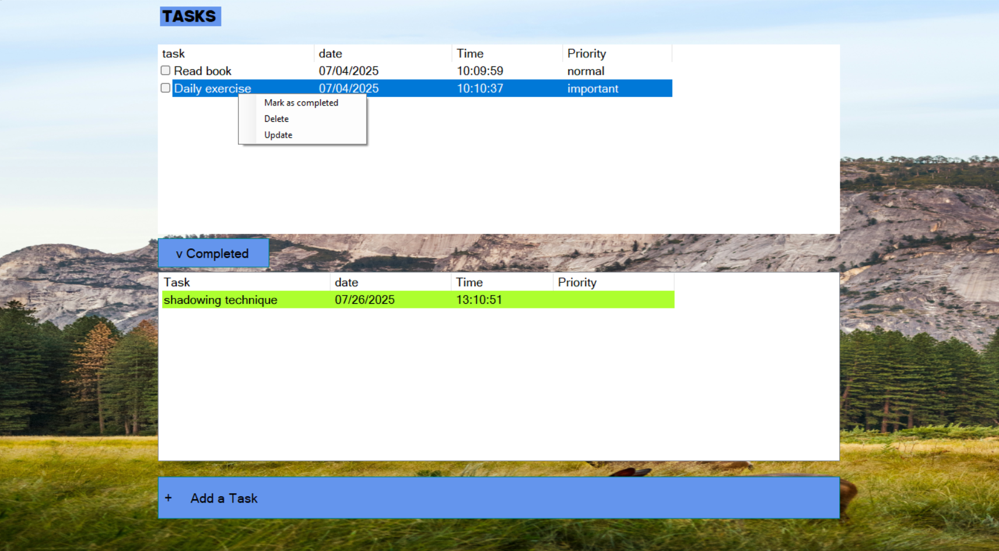
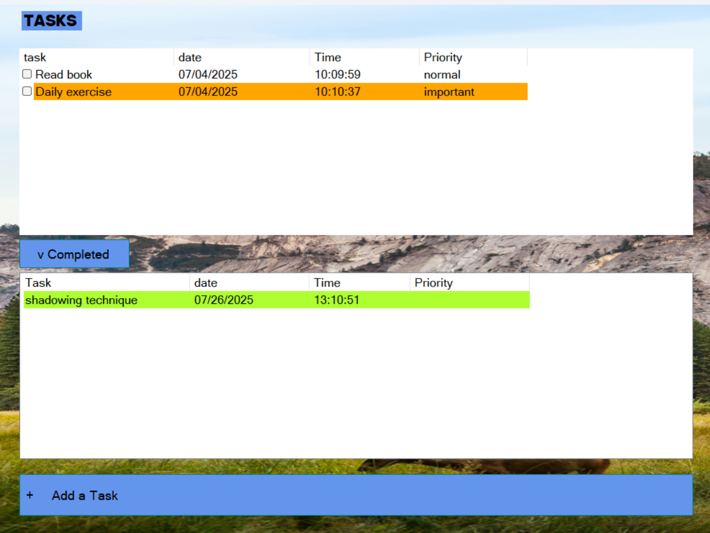
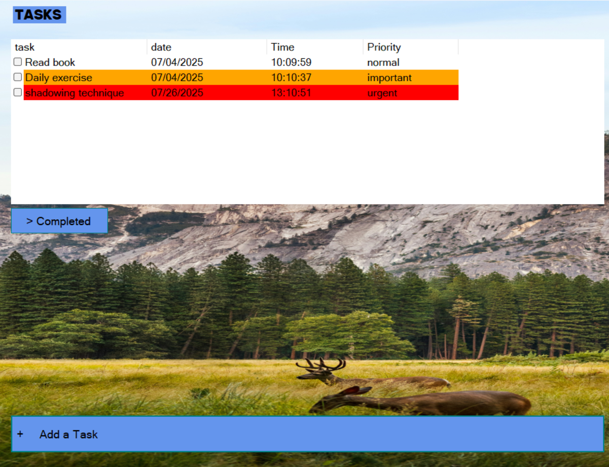

# 📋 TODO list


Add, complete, and delete tasks

- Set priorities (color-coded: Normal, Important, Urgent)
- Track deadlines (date/time)
- Toggle between active and completed tasks

 


##  :camera_flash: Screenshots  

---





---





---





---





### :warning: How to Run This Project on Your Computer


If you downloaded this project from the internet (e.g., from GitHub),  Windows might block some files. To ensure everything works correctly,  follow these steps:

1. Download and extract the project folder to your computer.

2. Open the folder.

3. Right-click on an empty space inside the folder and select **"Open in Terminal"**.

4. In the terminal, run the following command:

   ```
   Get-ChildItem -Recurse | Unblock-File
   ```

   ​    

Finally, double-click the `.sln` file in the folder to open the project in Visual Studio.


