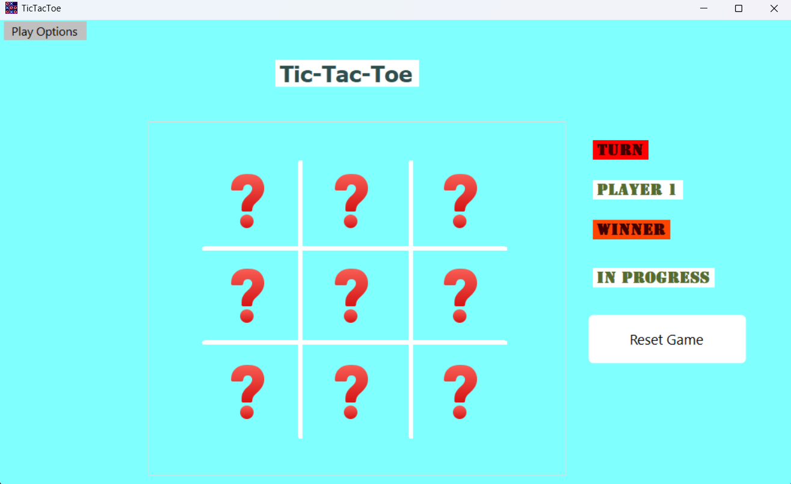
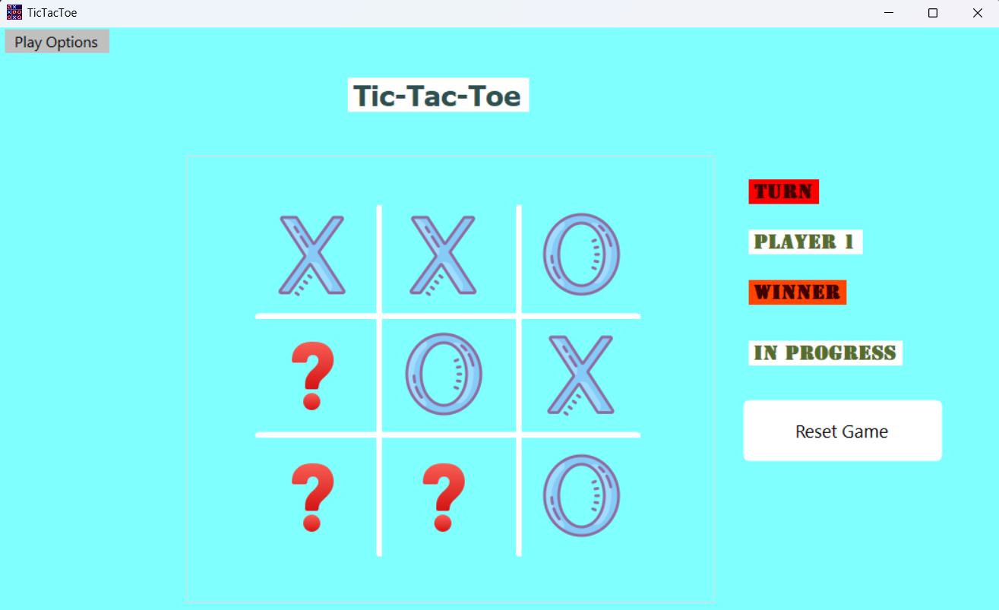
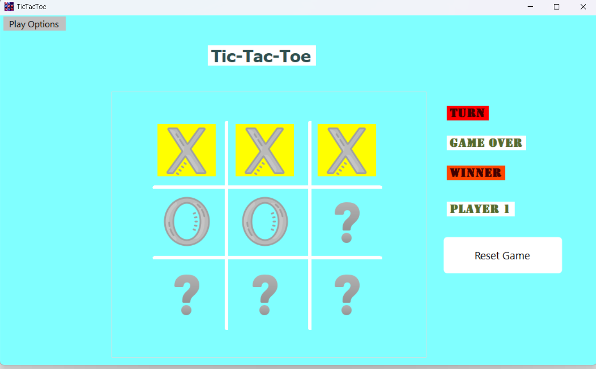
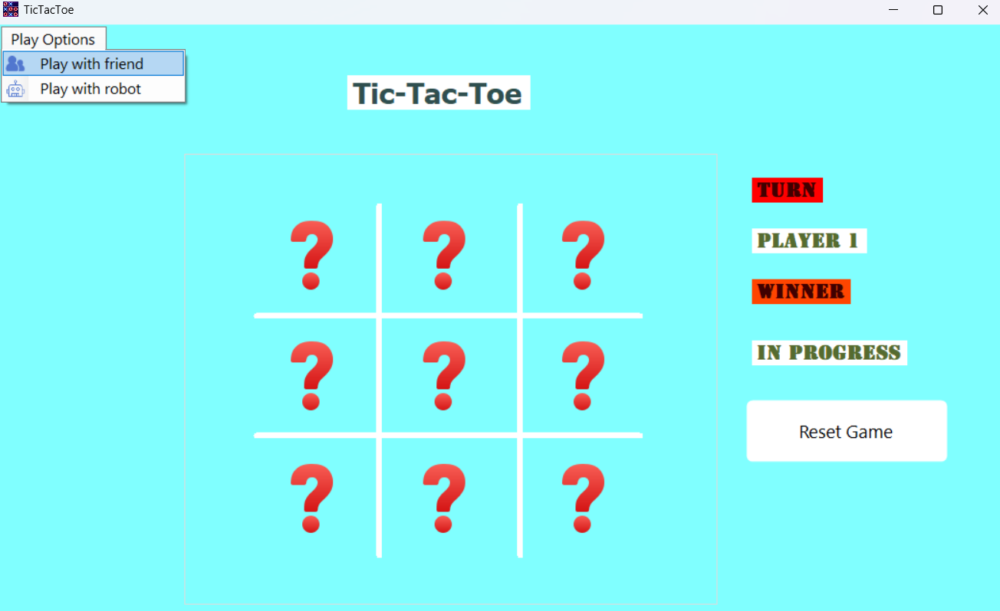

# Tic-Tac-Toe Game (C# Windows Forms)

A classic Tic-Tac-Toe game built with **C#** and **Windows Forms**, featuring two play modes: **Player vs. Player** and **Player vs. AI (random moves)**.

[Click here for the video](https://youtu.be/NkCipOAF1aI)





---





---





---




## 🚀 Features

- **Two Game Modes**:
  - Play against a friend (local multiplayer).
  - Play against a simple AI (random moves).
- **Win Detection**: Checks all possible winning combinations.
- **Visual Feedback**: Highlights winning moves in yellow.
- **Responsive UI**: Clean design with dynamically drawn board.
- **Reset Game**: Restart anytime with the "Reset" button.


### How to Run This Project on Your Computer


If you downloaded this project from the internet (e.g., from GitHub),  Windows might block some files. To ensure everything works correctly,  follow these steps:

1. Download and extract the project folder to your computer.

2. Open the folder.

3. Right-click on an empty space inside the folder and select **"Open in Terminal"**.

4. In the terminal, run the following command:

   ```
   Get-ChildItem -Recurse | Unblock-File
   ```

   ​    

Finally, double-click the `.sln` file in the folder to open the project in Visual Studio.