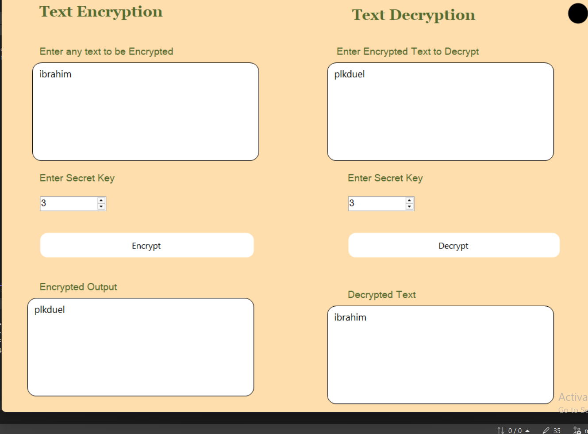
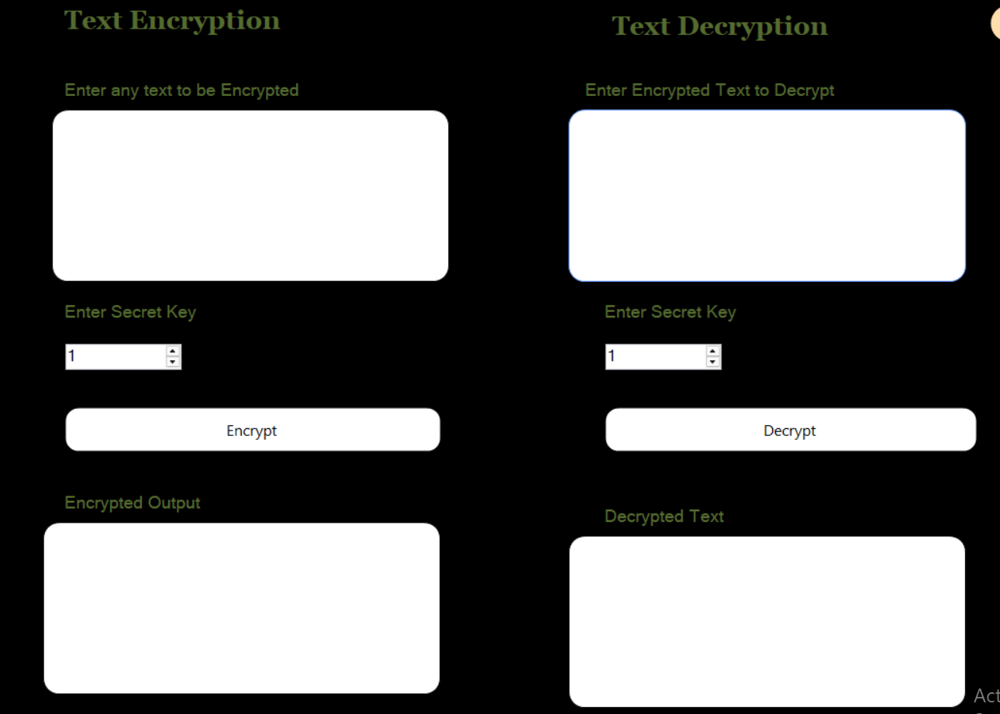

----





# 🔐 Text Encryption App

This is a simple Windows Forms application written in **C# (.NET Framework)** that allows users to **encrypt** and **decrypt** text using a basic character-shifting algorithm.

## 🧩 Features

- **Encrypt Text:** Reverse the input string and shift each character by a key value.
- **Decrypt Text:** Reverse the input string and shift characters back using the same key.
- **Custom Key Support:** Choose your own encryption/decryption key.
- **Dark Mode:** Toggle between light and dark themes.
- **Error Handling:** Displays error messages when input fields are empty.
- **Context Menu Shortcuts:** Quickly encrypt, decrypt, or clear text areas.

## ⚙️ How It Works

1. Enter a text to encrypt.
2. Select an encryption key (default: `5`).
3. Click **Encrypt** to see the encoded text.
4. Paste the encrypted text into the decrypt section.
5. Use the same key and click **Decrypt** to restore the original message.

The core logic is handled by two static methods:

```

```