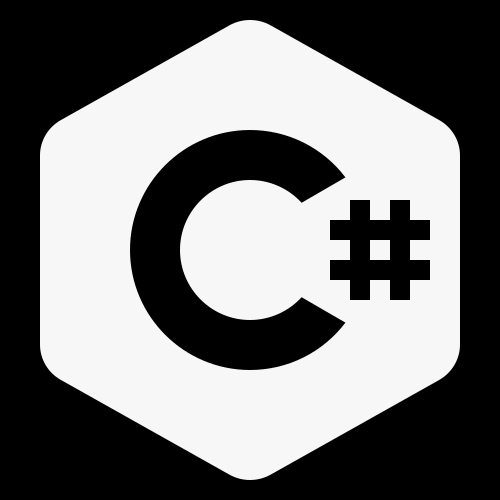

### How to Run This Project on Your Computer

If you downloaded this project from the internet (e.g., from GitHub), Windows might block some files. To ensure everything works correctly, follow these steps:

1. Download and extract the project folder to your computer.
2. Open the folder.
3. Right-click on an empty space inside the folder and select **"Open in Terminal"**.
4. In the terminal, run the following command:

   ```powershell
   Get-ChildItem -Recurse | Unblock-File

5. Finally, double-click the `.sln` file in the folder to open the project in Visual Studio.


#### 🔥 Upcoming Projects

1. **Paper-Scissors-Rock** – Classic game. ✂️
2. **Math Project** – A math-related C# application. ➗
3. **Simple Bank Project** – Basic banking system. 💰
4. **Flip Cards** – A memory card-flipping game. 🃏
5. **billiards game**  – A simple game 

*...and more coming soon!* 🚀


